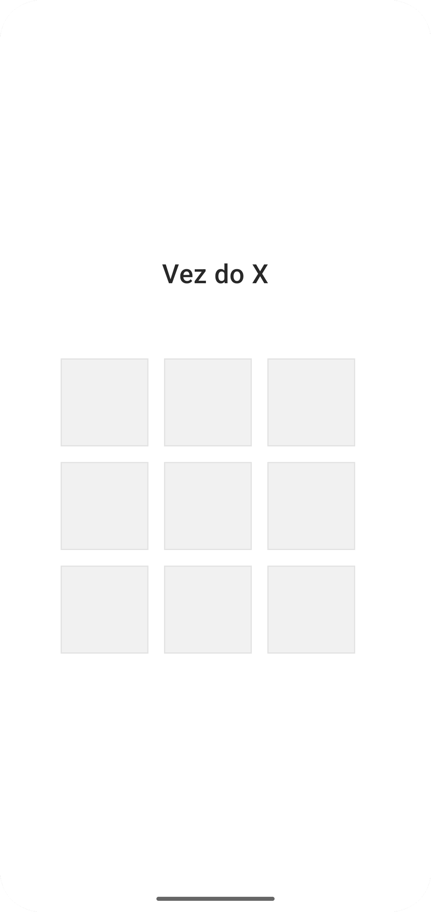
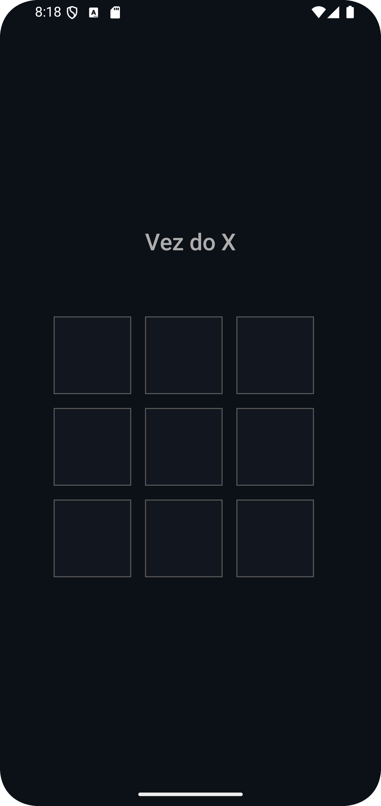
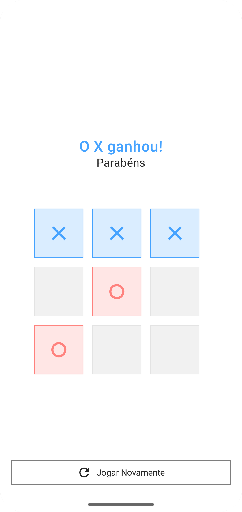
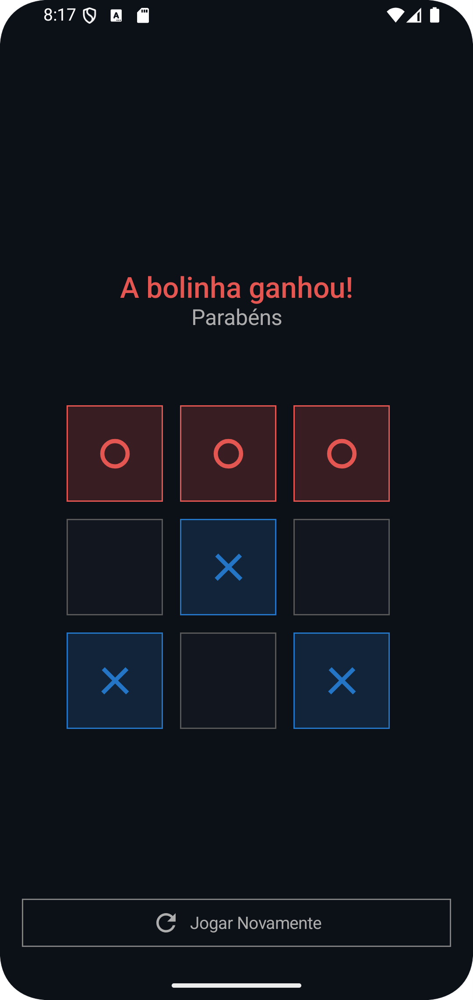

# Tic Tac Toe Game

Um jogo da velha multiplayer para dispositivos móveis. O objetivo do projeto é permitir que jogadores disputem partidas online por meio de um aplicativo Android integrado a um serviço de back-end.

> **Estado atual:** o projeto ainda está em desenvolvimento e, neste momento, funciona apenas no modo singleplayer/local, sem conexão com outros dispositivos. O modo multiplayer online ainda não foi implementado.

## Tecnologias

### Aplicativo mobile

- Kotlin
- Jetpack Compose
- Material Design 3

O código do aplicativo está localizado na pasta [`mobile`](./mobile).

### Back-end

O back-end será desenvolvido futuramente com:

- Kotlin
- Spring Boot

Ele será responsável pela comunicação necessária para as partidas multiplayer e demais recursos online do projeto.

## Funcionalidades atuais

- Partida singleplayer/local de jogo da velha;
- Alternância entre os jogadores X e O;
- Detecção de vitória e empate;
- Reinício da partida;
- Suporte aos temas claro e escuro do sistema.

## Screenshots

| Tela | Tema claro | Tema escuro |
|---|---|---|
| Tela inicial |  |  |
| Tela de vitória |  |  |

## Objetivo do projeto

A versão completa será um jogo da velha multiplayer, conectando o aplicativo mobile a uma API criada com Spring Boot e Kotlin. Até que essa integração seja desenvolvida, todas as partidas acontecem localmente no mesmo aparelho.

## Design

A interface deste projeto é baseada em um design disponibilizado na comunidade do Figma. Todos os créditos pela criação do design pertencem ao seu autor original.

- [Visualizar o design completo no Figma](https://www.figma.com/community/file/1165390279078711209)

## Executando o aplicativo

1. Abra a pasta `mobile` no Android Studio.
2. Aguarde a sincronização do projeto Gradle.
3. Selecione um emulador ou dispositivo Android.
4. Execute o módulo `app`.
